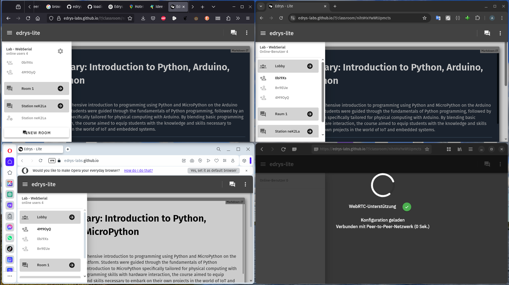
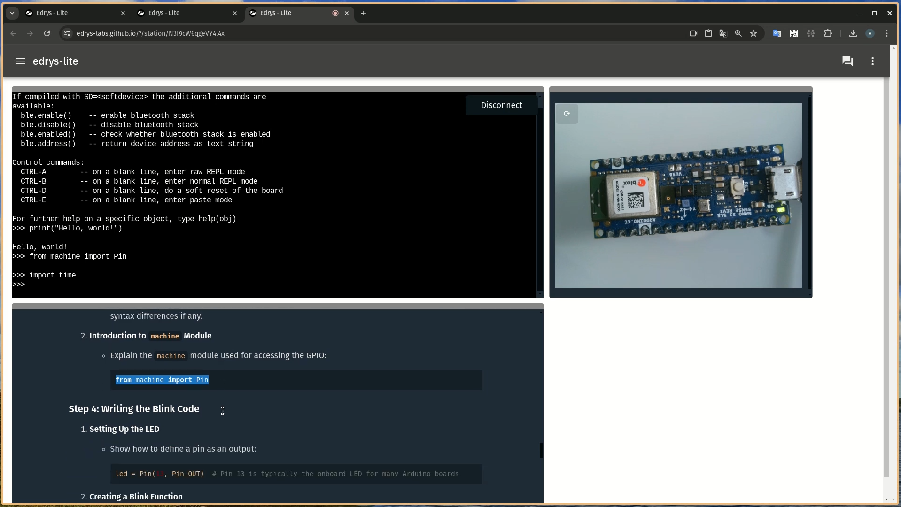
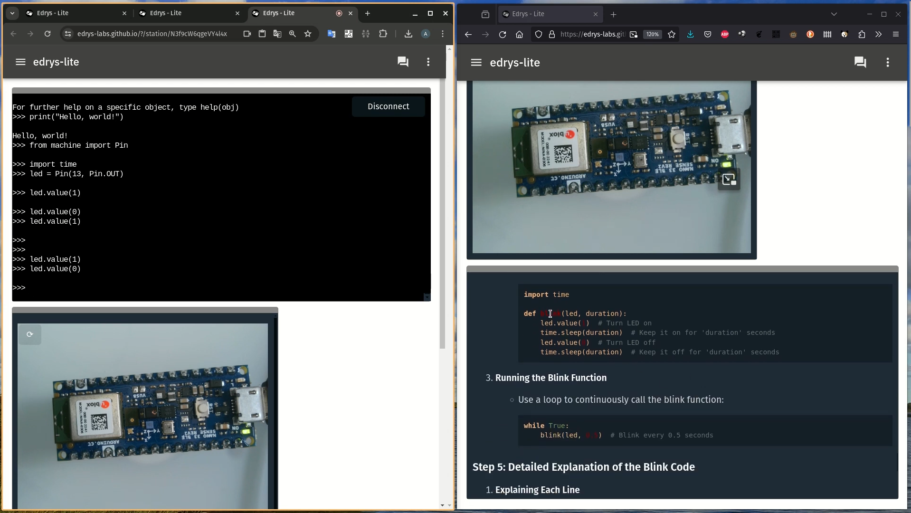
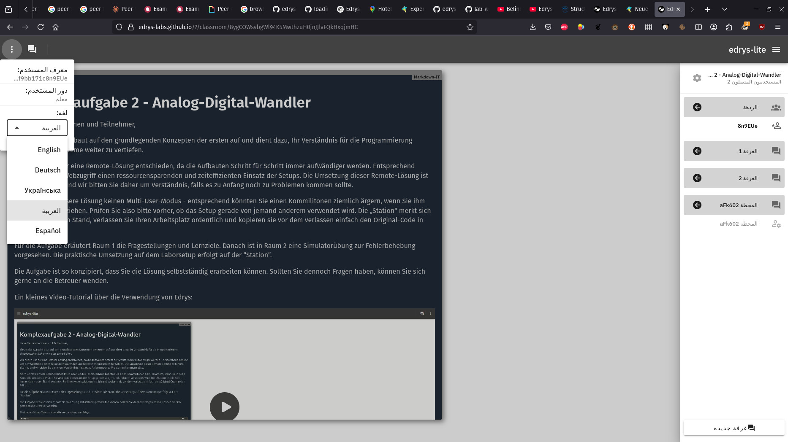
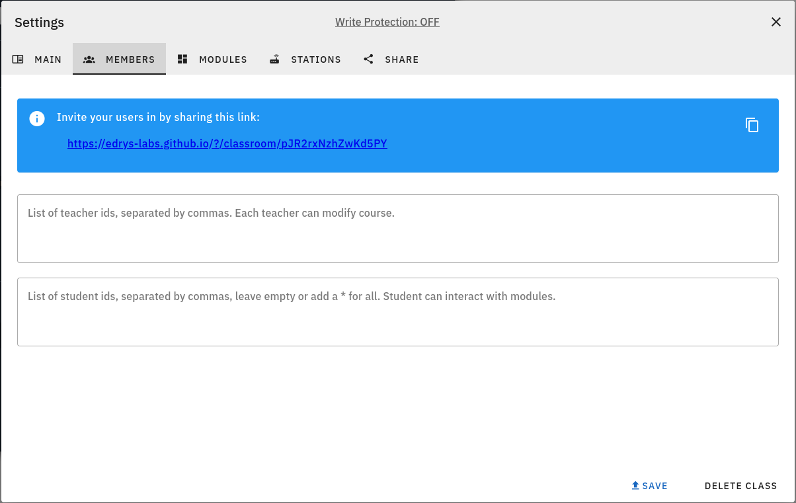
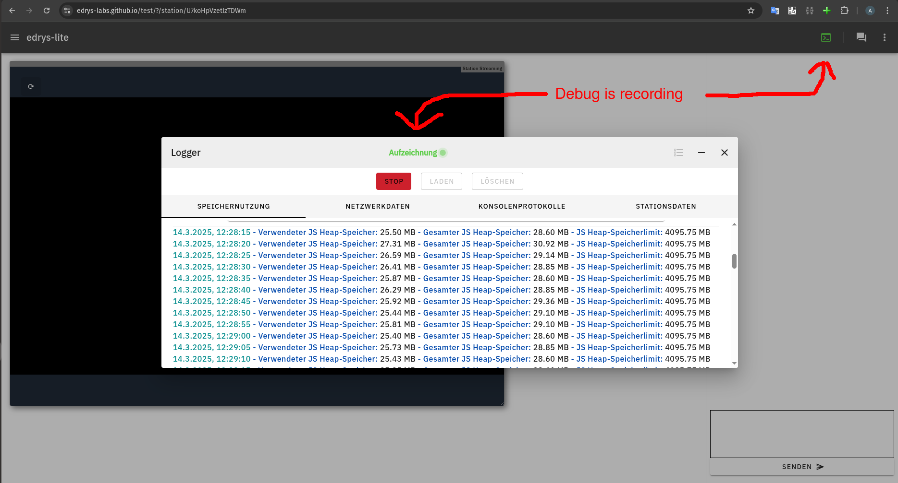
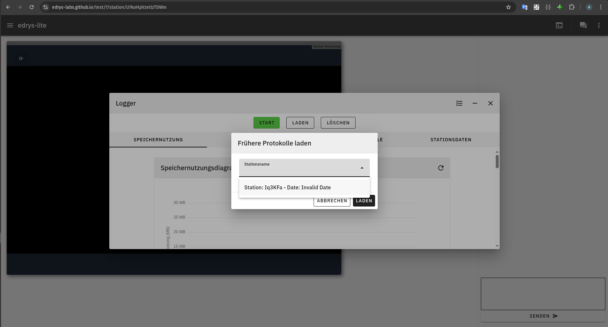

<!--
language: de
narrator: Deutsch Female
-->


# Experimente mit edrys-Lite

Ein Experiment in edrys-Lite ist eine interaktive, digitale Lernumgebung, in der die Schülerinnen und Schüler in Echtzeit zusammenarbeiten und auf Hardware zugreifen können.

## Idee

    --{{0}}--
Stellen sie sich vor, sie hätten ein Arbeitsblatt und ein Experiment, das sie mit ihren Schülern durchführen möchten. Sie könnten das Arbeitsblatt kopieren und an alle Schüler verteilen, die dann einzeln oder in kleinen Gruppen das Experiment durchführen.

      {{1}}
- __Arbeitsblatt als einfache Datei:__

      --{{1}}--
  In edrys‑lite ist ein „Experiment“ nichts anderes als eine einfache Datei, die alle wichtigen Einstellungen enthält – ähnlich wie ein vorbereitetes Unterrichtsblatt. Diese Datei einfach erstellt, verändert. Geteilt wird das Arbeitsblatt über einen Link.

  https://edrys-labs.github.io/?/deploy/https://raw.githubusercontent.com/edrys-labs/lab-web-serial/main/laboratory/micropython.yaml

  ```` yaml  MicroPython-Labor.yaml
  id: UFjCXcT4dfSsWcRm
  createdBy: 35banpdWTU7qL
  dateCreated: 1713791372082
  name: Lab - WebSerial
  meta:
    logo: >-
      https://raw.githubusercontent.com/edrys-labs/lab-web-serial/main/media/logo.jpg
    description: >-
      Discover the exciting world of coding with our MicroPython course...

    selfAssign: true
    defaultNumberOfRooms: 0
  members:
    teacher: []
    student: []
  modules:

  - url: >-
      https://raw.githubusercontent.com/edrys-labs/module-markdown-it/2.0.0/index.html
    config: >-
      # Course Summary: Introduction to Python, Arduino, and MicroPython
      ...
    studentConfig: ''
    teacherConfig: >-
      ## Teacher instructions

      ...
    stationConfig: ''
    showInCustom: Lobby
    width: full
    height: tall

  - url: https://edrys-labs.github.io/module-serial/
    config:
      baud: 115200
    studentConfig: ''
    teacherConfig: ''
    stationConfig: ''
    showInCustom: Station
    width: full
    height: medium

  - url: https://edrys-labs.github.io/module-station-stream/index.html
    config: ''
    studentConfig: ''
    teacherConfig: ''
    stationConfig:
      video: true
      audio: false
    showInCustom: Station
    width: half
    height: medium
  
  ...
  ````

      {{2}}
- __Peer to Peer Verbindung mittles WebRTC statt klassischer Server:__

      --{{2}}--
  Anstatt dass alle Daten über einen zentralen Server laufen, kommunizieren die Browser der Teilnehmer direkt miteinander. Das ist, als ob alle im Raum direkt miteinander sprechen würden – das spart Zeit, erzeugt keine Kosten und ist Datenschutskonform.

  

      {{3}}
- __Einfache Integration von Hardware:__

      --{{3}}--
  Hardware kann entweder direkt an den Laptop des Lehrers über eine Browser-Schnittstelle, wie zum Beispiel WebUSB, WebSerial angeschlossen werden oder über ein zusätzliches Programm, dass als "Server" den direkten und lokalen Zugriff auf das Experiment ermöglicht.

  

     {{4}}
- __Automatische Synchronisation der Arbeit mittels CRDTs:__

      --{{4}}--
  Wenn mehrere Personen gleichzeitig an einem Arbeitsblatt (Labor/Experiment) arbeiten, sorgt ein intelligentes System dafür, dass alle immer den aktuellen Stand sehen. Es ist, als würde eine Tafel im Klassenzimmer automatisch alle Änderungen anzeigen, egal wer gerade etwas ergänzt oder verändert.

  

     {{5}}
- __Ideal für kleine Gruppen:__

      --{{5}}--
  Da alles direkt im Browser läuft, brauchen die Nutzer weder komplizierte Anmeldungen noch teure Server – das macht edrys‑lite besonders attraktiv für kleine Gruppen oder Unterrichtssettings, wo Flexibilität und einfache Handhabung im Vordergrund stehen.

  !?[YouTube: Edrys MicroPython Lab](https://www.youtube.com/watch?v=6ZjGHorc2ds)

## Demo: SUUpoRT Urkraine


## Demo: Analog-Digital-Wandler

Ein weiterer Vorteil von edrys-Lite ist die Möglichkeit, mehrere Experimente parallel durchzuführen. Das bedeutet, dass die Schülerinnen und Schüler nicht nur an einem Experiment arbeiten können, sondern auch an mehreren gleichzeitig.

Die Studierenden setzen eine Anwendung um, die zwei existierende Klassen für die Verwendung von peripheren Bauteilen - Ultraschallsensor und LCD-Display - um. Im Ergebnis steht eine Applikation die kontinuierlich die Distanz zu einem Hindernis vermisst. Die Daten werden zudem über die Serielle Schnittstelle ausgegeben und analysiert.


## Neuerungen in edrys-Lite

1. Internationalisierung: Die Benutzeroberfläche von edrys-Lite ist nun in mehreren Sprachen verfügbar. Die Sprache kann in den Einstellungen des Browsers geändert werden.

   

2. Verbesserte Nutzereinstellungen:

   - Es können zusätzlich Lehrer angelegt werden, die Kursinhalte verändern können.
   - Es kann eine Liste von Studenten mit zugriff auf ein Experiment angelegt werden, alle anderen gelten dann als Zuschauer.

   

3. Dauerhafte und sichere Kommunikation:

   - Signaling und TURN Server werden jetzt in der TU Freiberg betrieben.
   - Verlust von Verbindungen wird jetzt mit Logical Clocks durchgeführt, mehr sicherheit bei Zeit und Datumsunterschieden.
  
4. Vollständige API:

   1. Messaging API: Ermöglicht den Austausch von Nachrichten zwischen den Teilnehmern.

      ```javascript
      Edrys.sendMessage("subject", "body");

      Edrys.onMessage(({from, subject, body}) => {
        console.log(subject, body);
      });
      ```

   2. Data API: Ermöglicht die Synchronisation von Daten zwischen den Teilnehmern.

      ```javascript
      const state = Edrys.getState("key", "Map");

      // set two values in the map
      state.set('option1', 12)
      state.set('option2', [12 , 22, true])

      // get the value of option1
      console.log(state.get('option1')) // 12

      // get the entire map
      console.log(state.toJSON())
      // Object { option1: 12, option2: [1, 2, 3] }
      ```

   3. Media API: Ermöglicht die Übertragung von Audio- und Videostreams zwischen den Teilnehmern.

      ```javascript
      Edrys.sendStream(stream);

      Edrys.onStream((stream, settings) => {
        videoElement.srcObject = stream;

        // A function to apply video settings (only video/audio, rotate...)
        applyVideoTransform(videoElement, settings);
      });
      ```

   4. Local Storage: Ermöglicht das Speichern von Daten im Browser.

      ```javascript
      Edrys.setItem("key", "value");

      Edrys.getItem("key") // value
      ```

5. Dokumentation als LiaScript:

   https://github.com/edrys-labs/documentation

   https://liascript.github.io/course/?https://raw.githubusercontent.com/edrys-labs/documentation/refs/heads/main/README.md

6. Debugging von Stationen:

   

   

7. Verbessertes UI:

   - Module können direkt ausgewählt und integriert werden ohne Copy & Paste von URLs.
   - Konfigurationsmenu, durch zusätzliche Metadaten.
   - Module werden durch zugehörige Räume hervorgehoben.
   - Mehr Konfigurationsmöglichkeite für Fenstergrößen